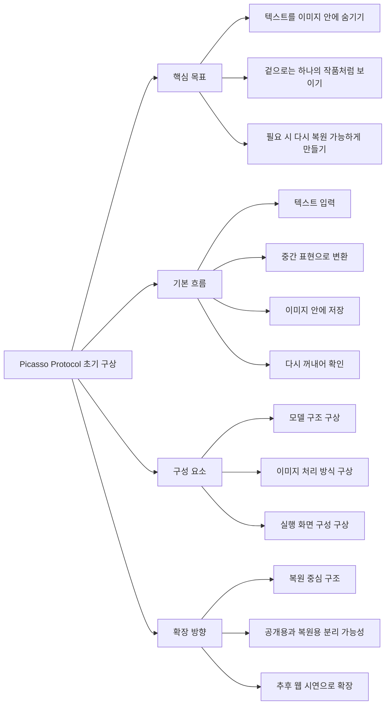

# Picasso Protocol 개발 일지 초안

## 프로젝트명
Picasso Protocol v1: 입체파 미학 기반 비대칭 텍스트 스테가노그래피 시스템

## 프로젝트 개요
본 프로젝트는 파블로 피카소의 입체파 표현 방식에서 착안하여, 하나의 인코더와 두 개의 디코더를 활용하는 비대칭 텍스트 스테가노그래피 시스템을 구현한 것이다. 입력 텍스트를 BERT 기반 인코더로 잠재 벡터로 변환한 뒤, 이를 RGBA PNG 이미지 내부에 바이트 단위로 삽입하여 은닉하고, Artist X와 Artist Y라는 두 개의 디코더를 통해 각각 원문 복원과 창의적 재해석을 수행하도록 구성하였다. 데스크톱 GUI와 웹 데모를 함께 제공하여 시연 가능성을 높였고, 학습 스크립트와 실행 문서를 분리하여 재현성을 확보하고자 하였다.

아래 내용은 이미 완성된 프로젝트를 3개의 개발 단계로 나누어 개발 일지 형식으로 다시 정리한 초안이다. `작성 일시`의 세부 시간은 실제 작업 시간에 맞게 수정해서 제출하면 된다.

## 1. 작성 일시: 2026.01.27 (실제 작업 시간으로 수정)

### 초기 계획 구조도

### 활동 내용
이번 단계에서는 프로젝트를 어떤 방향으로 전개할지 구상하는 데 집중하였다. 처음에는 단순히 텍스트를 숨기는 방식이 아니라, 이미지 속에 정보를 담으면서도 겉으로는 하나의 작품처럼 보이게 만드는 구조를 생각하였다. 그래서 결과물이 단순한 데이터 파일이 아니라, 시각적 의미와 정보 은닉 기능을 동시에 가지는 형태가 되도록 방향을 잡았다.  

또한 프로젝트를 한 번에 완성하기보다, 먼저 핵심 개념을 나누어 생각해 보았다. 텍스트를 다른 형태의 정보로 바꾸는 단계, 그 정보를 이미지 안에 담는 단계, 다시 꺼내어 확인하는 단계로 구분해 보면 전체 구조를 더 명확하게 설계할 수 있다고 판단하였다. 이 과정을 통해 프로젝트를 모델, 이미지 처리, 실행 화면이라는 세 흐름으로 나누어 접근하는 방향을 세웠다.  

이와 함께 프로젝트의 확장 가능성도 함께 구상하였다. 처음에는 하나의 복원 구조만 떠올렸지만, 이후에는 같은 입력으로도 서로 다른 결과를 만들 수 있는 방향이 더 흥미롭다고 생각했다. 그래서 장기적으로는 복원용과 공개용의 역할을 나누는 구조로 발전시킬 수 있도록 초반 아이디어를 정리하였다.

### 작업 중 발생한 문제와 해결
초기 구상 단계에서 가장 고민했던 부분은 정보 은닉과 시각적 표현을 어떻게 함께 가져갈 것인가였다. 정보를 너무 직접적으로 드러내면 이미지의 의미가 약해지고, 반대로 시각적 표현만 강조하면 복원이 어려워질 수 있다고 판단하였다. 그래서 기능성과 표현성을 동시에 살릴 수 있는 중간 지점을 찾는 방향으로 아이디어를 정리하였다.  

또한 프로젝트를 너무 복잡하게 시작하면 전체 흐름을 잡기 어렵다고 생각했다. 이를 해결하기 위해 처음부터 모든 기능을 넣기보다는, 먼저 핵심 개념을 정리하고 이후 단계에서 점차 확장하는 방식으로 계획을 세웠다. 이 덕분에 초반에는 전체 구조를 단순하게 바라보면서도, 나중에 기능을 넓힐 수 있는 여지를 남길 수 있었다.

### 구현한 결과
이 단계가 끝났을 때는 프로젝트의 전체 방향과 핵심 개념이 정리된 상태가 되었다. 텍스트를 이미지 안에 담는 방식, 이를 다시 꺼내 확인하는 흐름, 그리고 이후 확장 가능한 구조까지 큰 틀에서 구상할 수 있었다. 아직 본격적인 구현이 모두 진행된 것은 아니었지만, 이후 개발을 이어갈 수 있는 기본 계획과 설계 방향은 충분히 마련된 상태였다.

## 2. 작성 일시: 2026.02.01 (실제 작업 시간으로 수정)

### 활동 내용
이번 단계에서는 Artist X만 구현된 상태에서 한 걸음 더 나아가, 프로젝트의 차별점인 Artist Y 구조를 정리하였다. `ver.3/train/artist_y_train.py`에서 Artist X의 인코더를 그대로 공유하면서, Artist Y는 별도의 디코더를 이용해 같은 잠재 벡터로부터 다른 텍스트를 생성하도록 개념 구조를 작성하였다. 이후 `ver.3/train/y_bundler.py`를 통해 X의 인코더를 Y에 탑재하여 독립 실행 가능한 `artist_y_standalone.pth` 파일을 만들 수 있는 흐름도 정리하였다. 이를 통해 “하나의 인코더 + 두 개의 디코더”라는 프로젝트 핵심 아이디어가 코드로 더 분명하게 표현되었다.  

같은 시기에는 웹 시연 환경도 함께 만들었다. `toWebPage/index.html`에서 Artist X와 Artist Y 모드를 선택할 수 있도록 UI를 구성하였고, 텍스트 입력, PNG 생성, 이미지 업로드, 디코딩 결과 확인이 한 화면에서 이루어지도록 설계하였다. 또한 `toWebPage/server.py`를 Flask API 방식으로 작성하여 `/encode`, `/decode` 요청을 처리하도록 연결하였다.

### 작업 중 발생한 문제와 해결
이 단계에서는 프로젝트 구성이 점점 많아지면서 실행 순서를 정리하는 일이 중요해졌다. 학습 스크립트, 데스크톱 앱, 웹 서버, 웹 페이지가 각각 따로 존재하다 보니 처음 보는 사람이 전체 흐름을 이해하기 어렵다고 느꼈다. 이를 해결하기 위해 `README.md`를 보강하여 필요한 라이브러리, 모델 파일 위치, 실행 순서, API 설명, 데이터셋, 참고문헌을 한 번에 확인할 수 있도록 정리하였다.  

또한 Artist Y는 구조상 흥미롭지만, 실제로 의미 있는 재해석 결과를 만들기 위해서는 별도의 창의적 데이터셋이 필요하다는 점도 확인하였다. 따라서 현재 단계에서는 Y의 개념 구조와 동작 방식을 먼저 정리하고, 실제 학습은 향후 확장 과제로 남겨 두었다.

### 구현한 결과
이 단계가 끝났을 때는 Artist X와 Artist Y의 역할 구분이 명확해졌고, 웹에서도 텍스트를 이미지로 바꾸고 다시 읽는 시연이 가능해졌다. 또한 프로젝트의 핵심 구조와 실행 방법을 문서화하여, 발표 자료나 보고서에서 설명하기 쉬운 상태로 정리할 수 있었다.

## 3. 작성 일시: 2026.04.13 (실제 작업 시간으로 수정)

### 활동 내용
마지막 단계에서는 완성된 프로젝트를 다시 점검하고, 제출용 자료와 발표용 설명을 정리하는 작업을 진행하였다. 먼저 `README.md`, `toWebPage/server.py`, `ver.3/app_x.py`, `ver.3/app_y.py`, `ver.3/train/artist_x_train.py`, `ver.3/train/artist_y_train.py`, `ver.3/train/image_utils.py`를 다시 검토하면서 각 파일이 담당하는 역할을 정리하였다. 이를 통해 입력 텍스트가 잠재 벡터가 되고, 그 벡터가 PNG 안에 들어가며, Artist X와 Artist Y가 서로 다른 결과를 만든다는 전체 흐름을 더 명확하게 설명할 수 있도록 정리하였다.  

또한 저장소 안에 남아 있는 결과 이미지 `11.png`, `22.png`, `My Secret.png`, `용준.png`를 확인하면서, 이 파일들을 보고서의 실행 결과 예시 자료로 활용할 수 있도록 정리하였다. 각 이미지가 단순한 그림이 아니라 실제 텍스트를 은닉한 PNG 결과물이라는 점도 함께 설명할 수 있도록 메모하였다.

### 작업 중 발생한 문제와 해결
최종 점검 과정에서는 실제 모델 가중치 파일인 `artist_x_best_model.pth`, `artist_y_standalone.pth`가 현재 저장소에 포함되어 있지 않다는 점을 다시 확인하였다. 처음에는 누락처럼 보일 수 있다고 생각했지만, 정리해 보니 코드 저장소와 모델 파일 저장 위치를 분리하여 관리한 결과라고 설명하는 것이 더 적절했다. 즉, 코드와 문서, 결과 예시는 저장소에 두고, 용량이 큰 모델 파일은 별도 드라이브에 두는 방식으로 관리한 것이다.  

또한 제출 전에 코드 정리 상태를 확인하기 위해 주요 파이썬 파일들에 대한 문법 점검도 다시 진행하였다.

### 구현한 결과
이 단계가 끝났을 때는 프로젝트 구조, 구현 결과, 예시 이미지, 참고문헌까지 포함하여 제출 가능한 형태로 정리된 상태가 되었다. 실제 모델 파일만 준비되면 웹 서버와 GUI를 이용해 텍스트 은닉과 복원 과정을 시연할 수 있으며, 전체 프로젝트를 하나의 완성된 결과물로 설명할 수 있게 되었다.

## 현재까지 구현한 결과 요약

| 구분 | 구현 내용 |
| --- | --- |
| 모델 구조 | 공유 인코더 1개와 서로 다른 디코더 2개를 사용하는 Artist X / Artist Y 구조 구현 |
| 텍스트 은닉 | 입력 텍스트를 잠재 벡터로 변환한 뒤 PNG RGBA 바이트에 직접 삽입 |
| 복원 기능 | 이미지에서 길이 정보와 잠재 벡터를 다시 읽어 텍스트 복원 |
| 재해석 기능 | 동일한 잠재 벡터를 Artist Y 디코더에 입력하여 새로운 텍스트 생성 |
| 데스크톱 인터페이스 | Tkinter 기반 Artist X, Artist Y 앱 구현 |
| 웹 인터페이스 | Flask API + HTML/Tailwind 기반 시연 페이지 구현 |
| 검증 상태 | 주요 파이썬 스크립트 문법 검증 완료, 결과 예시 PNG 4장 확인 |

## 생성형 AI 서비스 활용 내용

**생성형 AI 서비스 명칭:** ChatGPT (OpenAI Codex/GPT-5 계열)

1. 프롬프트(생성형 AI에게 한 질문)  
   현재 저장소의 `README.md`, `server.py`, `app_x.py`, `app_y.py`, 학습 스크립트를 바탕으로 개발 활동 보고서 초안을 정리하고, 참고문헌을 누락하지 않도록 서술해 달라고 요청하였다.

2. 얻은 답변  
   저장소 구조를 단계별 개발 과정으로 재정리한 활동 기록, 구현 결과 요약, 참고문헌 목록, 최종 구현 결과에 넣을 수 있는 이미지 활용 방안이 정리된 초안을 받았다.

3. 나의 활동  
   생성형 AI가 정리한 내용을 그대로 사용하지 않고, 실제 저장소 파일명, 커밋 시각, 구현 기능, 이미지 자산을 하나씩 대조하여 사실 관계를 확인하였다. 특히 Artist X와 Artist Y의 역할 차이, PNG 내부에 원문 길이를 함께 저장하는 방식, 웹 시연 구조, 모델 파일이 저장소에 포함되지 않은 이유를 직접 검토한 뒤 문장을 수정하여 보고서에 반영하였다.

## 인터넷 검색 및 참고 사이트 활용 내용

**참고한 사이트 URL(주소):**

- [https://arxiv.org/abs/1810.04805](https://arxiv.org/abs/1810.04805)
- [https://arxiv.org/abs/2505.04116](https://arxiv.org/abs/2505.04116)
- [https://huggingface.co/datasets/Salesforce/wikitext](https://huggingface.co/datasets/Salesforce/wikitext)

1. 나의 활동  
   BERT 논문은 인코더와 디코더를 활용한 텍스트 표현 학습의 이론적 배경을 정리하는 데 참고하였다. RFNNS 논문은 신경망 기반 스테가노그래피가 어떤 방식으로 연구되고 있는지 비교 대상으로 활용하여, 본 프로젝트가 텍스트 잠재 벡터를 이미지 안에 숨긴다는 점에서 어떤 연구 맥락에 놓이는지 설명하는 데 사용하였다. Hugging Face의 WikiText 데이터셋 페이지는 `wikitext-2-raw-v1` 구성을 확인하고, 학습 데이터셋 선정 및 전처리 설명을 정리하는 데 활용하였다.

## 최종 구현 결과

본 프로젝트의 최종 구현 결과는 텍스트를 바로 읽을 수 없는 추상 PNG 이미지로 변환한 뒤, 동일 이미지에 대해 Artist X 모드에서는 원문 복원, Artist Y 모드에서는 재해석된 결과를 생성하도록 설계된 점에 있다. 저장소에는 이미 생성된 결과 이미지 예시가 포함되어 있으며, 이 이미지는 보고서의 실행 결과 캡처 자료로 활용할 수 있다.

### 실행 결과 예시 1
`11.png`는 텍스트 정보가 포함된 추상 이미지 예시이다. 중앙의 격자 형태 시각화는 잠재 벡터를 시각적으로 표현한 부분이며, 이미지 전체 바이트에는 실제 복원용 정보가 삽입되어 있다.

### 실행 결과 예시 2
`22.png`는 다른 입력 텍스트 또는 다른 잠재 표현으로부터 생성된 추상 PNG 예시이다. 같은 구조를 유지하면서도 시각 패턴이 달라지는 점을 통해 입력 정보에 따라 결과가 달라짐을 보여준다.

### 실행 결과 예시 3
`My Secret.png`는 비밀 메시지를 감춘 결과물로 활용할 수 있는 예시 이미지이다. 보고서에는 “실행 후 장면” 또는 “텍스트를 PNG 이미지로 은닉한 결과”로 설명해 첨부할 수 있다.

### 실행 결과 예시 4
`용준.png` 역시 같은 방식으로 생성된 PNG 결과물이며, 여러 메시지에 대해 동일한 은닉 구조가 반복적으로 작동함을 보여주는 샘플로 사용할 수 있다.

## 참고 문헌

[1] Jacob Devlin, Ming-Wei Chang, Kenton Lee, and Kristina Toutanova, “BERT: Pre-training of Deep Bidirectional Transformers for Language Understanding,” arXiv preprint arXiv:1810.04805, 2018. Available: https://arxiv.org/abs/1810.04805

[2] Yu Cheng, Jiuan Zhou, Jiawei Chen, Zhaoxia Yin, and Xinpeng Zhang, “RFNNS: Robust Fixed Neural Network Steganography with Universal Text-to-Image Models,” arXiv preprint arXiv:2505.04116, 2025. Available: https://arxiv.org/abs/2505.04116

[3] Salesforce, “Dataset Card for ‘wikitext’,” Hugging Face Datasets. Available: https://huggingface.co/datasets/Salesforce/wikitext
